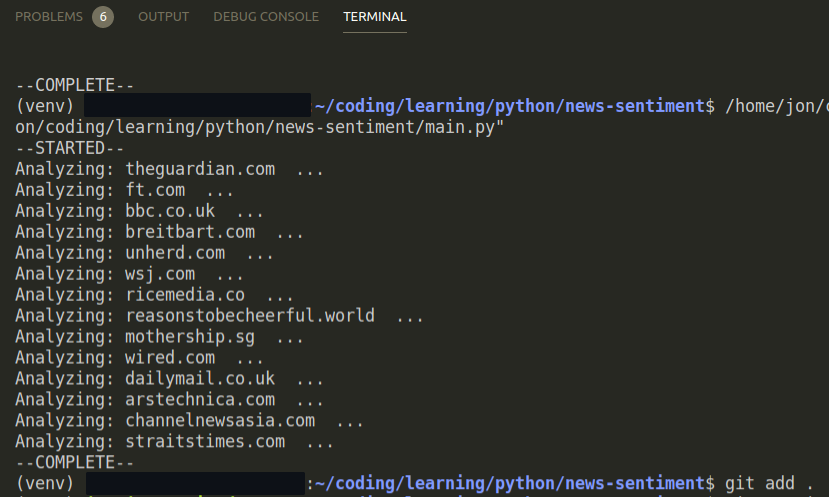
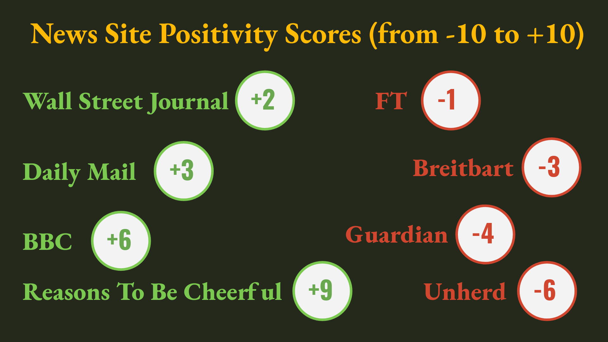

# News Sentiment

Analyzes the overall positivity of news sites. Can be used on any other sites as well.

# Table of Contents
- [News Sentiment](#news-sentiment)
- [Table of Contents](#table-of-contents)
- [How to use](#how-to-use)
  - [`summary.json`](#summaryjson)
  - [`raw_data.json`](#raw_datajson)
- [Scoring methodology](#scoring-methodology)
- [Sample results](#sample-results)
- [License](#license)

# How to use

Place all the sites you wish to analyse in the [websites.txt](./websites.txt) file and install all the packages from [requirements.txt](./requirements.txt). Then run [main.py](./main.py) with your **Python 3** interpreter.

The script will show the website it's processing at a given point in time:



When it's complete, the script will print a notification and generate two `JSON` files.

## `summary.json`

`summary.json` contains a list of dictionaries; each dictionary represents one URL that we had in `requirements.txt`. 

If the website analysis is successful, the URL's dictionary will look like this:

```json
{
  "url": "wired.com",
  "data": {
    "avg_score": 5,
    "max_score": 9.062999999999999,
    "max_text": "The Best Laptop Stands to Save Your Neck",
    "min_score": -7.548,
    "min_text": "A Fight Over GameStop's Soaring Stock Turns Ugly"
  }
}
```

You will notice that the `data` key returns a dictionary with the following information:
- `avg_score` - the overall positivity score for the entire website. **This is the key data point in the output.**
- `max_score` and `min_score` - the maximum and minimum scores achieved by a single piece of text on the website
- `max_text` and `minimum_score` - the single piece of text that yielded the maximum score and the minimum score, respectively

All scores usually range between -10 and +10.

If the analysis is unsuccessful, the `data` key will explain the cause of the problem:

```json
{
  "url": "nowebsite",
  "data": "An error occurred when trying to access the 'https://nowebsite' URL. Error message: 'HTTPSConnectionPool(host='nowebsite', port=443): Max retries exceeded with url: / (Caused by NewConnectionError('<urllib3.connection.HTTPSConnection object at 0x7fa4493462b0>: Failed to establish a new connection: [Errno -2] Name or service not known'))'"
}
```

## `raw_data.json`

As with `summary.json`, `raw_data.json` holds a list of dictionaries that each represent a URL. Below is a dictionary generated by a successful website analysis:

```json
{
  "url": "theguardian.com",
  "data": [
    {
      "text": " Experts defend UK decision to delay second Pfizer jab",
      "combined_score": -2.591,
      "vader_score": -0.3182,
      "afinn_score": -1.0
    },
    {
      "text": " Three arrested in inquiry into 6m Covid fraud",
      "combined_score": -10.9225,
      "vader_score": -0.7845,
      "afinn_score": -7.0
    },
    {
      "text": " Big crowds at airport 'incredibly worrying'  Labour",
      "combined_score": -4.0024999999999995,
      "vader_score": -0.4005,
      "afinn_score": -2.0
    }
  ]
}
```

The `data` key provides the following information:
- `text` - a piece of text from the website that was analyzed
- `vader_score` and `afinn_score` - the text's score when it was run through the VADER and AFINN sentiment analysis tools - [go here](#scoring-methodology) for more details

An error during the website's processing will cause the `data` key to return a value of `null`:

```json
{ "url": "nowebsite", "data": null }  
```

If we can't generate any scores from the website, we get an empty array:

```json
{ "url": "google.com", "data": [] }
```

# Scoring methodology

After successfully reading a website, the script uses [Beautiful Soup](https://www.crummy.com/software/BeautifulSoup/bs4/doc/) to break down the site's text content into separate chunks based on the structure of the HTML.

Each of these pieces of text is run through two sentiment analysis libraries to generate positivity scores: 
- [afinn](https://github.com/fnielsen/afinn) - uses the AFINN methodology developed by Finn Arup Nielsen. Results range between -5 and +5, but they can sometimes go beyond those two thresholds.
- [vaderSentiment](https://github.com/cjhutto/vaderSentiment) - uses the VADER (Valence Aware Dictionary and sEntiment Reasoner) methodology created by C.J. Hutto and Eric Gilbert. Produces values between -1 and +1.

The two scores are combined using the following procedure:
- If only one of the two scores is 0, the composite score takes the non-0 value.
- If both are 0, the composite score is 0.
- If none are 0, the two individual scores are standardised to range between -10 and +10. The composite score then takes the average between these two values: `(afinn_score * 2 + vader_score * 10) / 2`.

To arrive at the website's total score, we add each of the composite scores as a +10 or a -10, depending on whether the composite score is positive or negative. This value is  divided by the number of non-0 composite scores and multiplied by 2 to arrive at the final score of the site. 

The reason I multiply by 2 is because it somewhat standardises the scores so that they range between -10 and +10. There is definitely scope to improve this methodology :)

# Sample results

Here are some extracts of the results I obtained with this script



```json
unherd -6
ricemedia -5
guardian -4
breitbart -3
mothership -2
ft -1
wsj +2
straits times +2
daily mail +3
ars technica +3
wired +5
BBC +6
channel news asia +7
reasons to be cheerful +9
```

# License 
Licensed under [Mozilla Public License 2.0](./LICENSE)